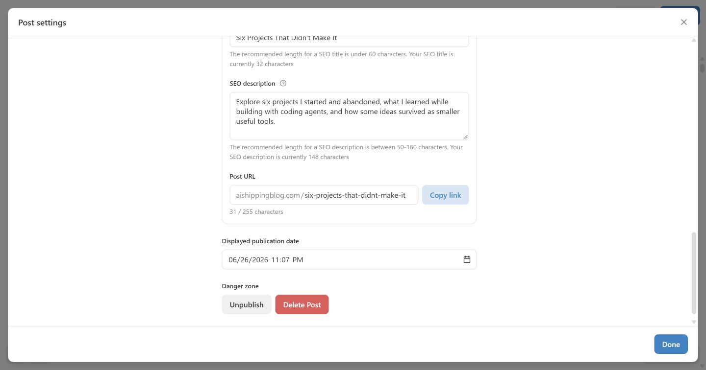
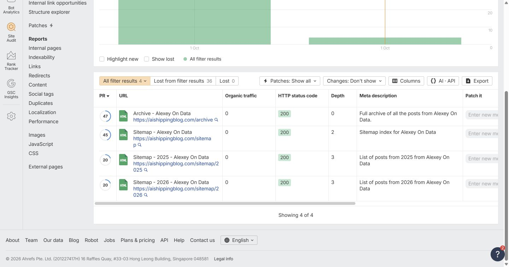

# October 1, 2026 — short meta descriptions

## Trigger and scope

Ahrefs email subject: **(Aishippingblog) Meta description too short: 40 URLs**.

The original audit for project 10427571 analyzed 96 internal URLs. The work addressed the 40 short-description warnings only.

## Changes

Edited the dedicated SEO description on 33 published Substack posts. Three comment pages inherited their parent posts' replacements, so 36 affected URLs changed in total. Descriptions were written after reading the articles, then verified against live HTML. Replacement lengths range from 134 to 157 characters.

Visible subtitles, article bodies, SEO titles, slugs, publication dates, and audience settings were not intentionally changed. No posts were emailed or republished through the main Update flow as part of this repair.

The original audit's descriptions are the baseline in the ledger. Where a page had already changed since that audit, the record still preserves the audited value; it should not be treated as a fresh capture immediately before each edit.

## Verification

All 36 repaired URLs were checked directly for the expected `<meta name="description">` content.

A fresh Ahrefs crawl completed later that evening. The current issue report confirmed:

- **Meta description too short: 4**, down from 40.
- **Meta description changed: 36**.

The remaining table contained only:

| URL path | Description | Length |
| --- | --- | ---: |
| `/archive` | Full archive of all the posts from Alexey On Data. | 50 |
| `/sitemap` | Sitemap index for Alexey On Data | 32 |
| `/sitemap/2025` | List of posts from 2025 from Alexey On Data | 43 |
| `/sitemap/2026` | List of posts from 2026 from Alexey On Data | 43 |

No per-page edit controls were found for these generated pages. They remain unresolved; the audit warnings were not ignored.

## Evidence and exact changes

- [Structured ledger](meta-descriptions.json): all 40 original URLs, audited descriptions, replacement text where applicable, and outcome.
- [Text ledger](meta-description-changes.txt): the same change history in a readable form, with the final re-crawl result added.
- [Saved SEO field screenshot](saved-seo-description.png)
- [Fresh Ahrefs remaining-results screenshot](remaining-ahrefs-issues.png)

