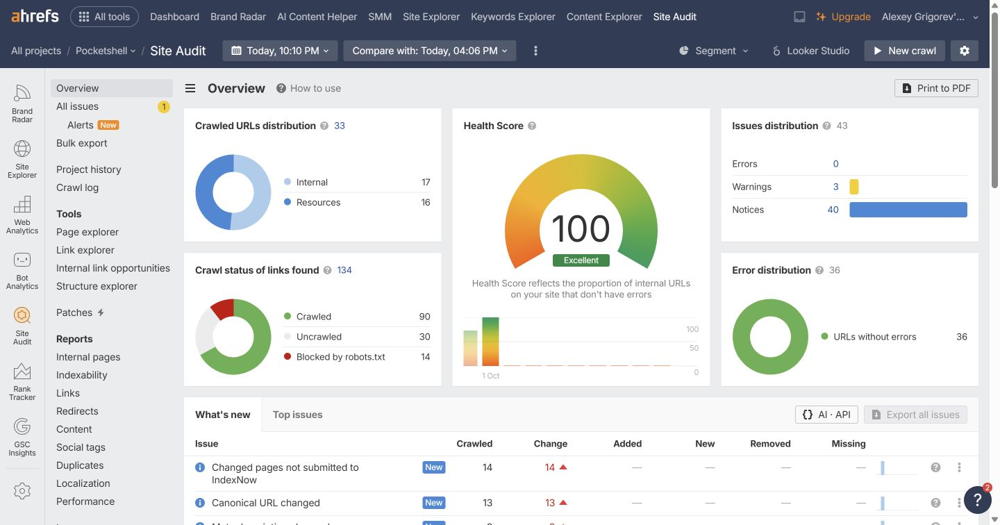

# October 1, 2026 — canonical URLs and metadata

## Evidence and cause

Ahrefs project `10427569`, crawl `01-10-2026T140657`, reported 13
non-canonical sitemap pages and 13 canonicals pointing to redirects.
[Captured issue table](ahrefs-baseline.txt) lists the blog index and twelve
posts. Each sitemap URL returned 200 and ended in `/`; each declared
canonical omitted the final `/` and returned 301.

The source was at commit
`d445b13f3a7a5b2b9067df6faab15a8077f4cc60`. `_config.yml` already used
`/blog/:title/`, but `_includes/head.html` constructed canonical URLs from
`/blog` and the slug without the final slash. Cards and Markdown links
repeated that convention.

## Changes

- Generate canonical, `og:url`, and JSON-LD URLs from `page.url`.
- Use `p.url` for cards and trailing slashes in Markdown cross-links.
- Shorten the homepage description and seven post descriptions (remote
  agent setup, aplexer introduction, phone checks, agent management,
  parallel agents, iPad/iPhone SSH, and crash warnings).
- Add shorter `seo_title` values for persistent tmux sessions and aplexer
  crash warnings. Visible headings stay unchanged.
- Escape blog titles/descriptions in HTML metadata.
- Add `scripts/check-seo.mjs`, `make check`, pull-request CI, and a check
  before deployment.

[changes.json](changes.json) records per-post metadata and canonical URLs
before/after, plus the homepage description and blog index URL change.

Implementation:
[PR #3](https://github.com/PocketShell-io/pocketshell-site/pull/3), commit
`c79f83ba104bd43a68011f2d624b0e2d121f7081` on
`fix/ahrefs-canonical-urls`.

## Validation

The checker failed on the original generated output (233 diagnostics,
including repeated internal links and multiple checks per canonical).
This is not a count of unique Ahrefs issues.

rustkyll v0.5.3 rebuilt successfully on Windows: 17 generated pages and 14
sitemap entries. The fixed-output check passes:

```text
SEO check passed: 14 sitemap pages, 13 blog pages, 121 internal blog links
```

Chrome preview confirmed `/blog/` declares `https://pocketshell.io/blog/`,
and its first card links to `/blog/aplexer-agent-multiplexer/`. The crash
warnings post declares its matching trailing-slash canonical, uses the
shorter search title, and retains the original visible heading.

[Linux CI run](https://github.com/PocketShell-io/pocketshell-site/actions/runs/36918807641)
also passed using the production builder and Node.js 22.


## Status and remaining verification

PR #3 merged on October 1 at 20:06:45 UTC, merge commit
`bab70acf26790891b7bcd721e95ff76971130cc0`. The
[Pages deployment](https://github.com/PocketShell-io/pocketshell-site/actions/runs/36919198209)
completed successfully.

[Live verification](live-verification.json) fetched the sitemap and all 14
listed pages with redirect following disabled: every response was HTTP 200.
The actual downloaded production HTML passed the same checker (14 sitemap
pages, 13 blog pages, 121 internal blog links), including self-canonicals,
metadata limits, and social/structured-data URLs.

The post-deployment Ahrefs crawl `01-10-2026T221021P0200` completed with
36 URLs crawled, 17 internal pages, **health score 100 (previously 73)**,
zero errors, three warnings, and 40 notices.

The all-tracked issue table confirms:

| Original issue | Before | After |
| --- | ---: | ---: |
| Canonical points to redirect | 13 | 0 |
| Non-canonical page in sitemap | 13 | 0 |
| Page has links to redirect (indexable / non-indexable) | 1 / 13 | 0 / 0 |
| Meta description too long (indexable / non-indexable) | 1 / 7 | 0 / 0 |
| Title too long (non-indexable) | 2 | 0 |

Ahrefs also confirms 13 canonical changes, eight description changes, and
two title-tag changes. [Structured recrawl results](ahrefs-resolved-issues.json)
preserve the observed counts.

Remaining findings include three redirect warnings, two HTTP-to-HTTPS
redirect notices, one robots-disallow notice, change notices, and 14 changed
pages not submitted to IndexNow. A health score of 100 means zero errors
in this audit, not the absence of all warnings or notices.



Intentional redirects (HTTP to HTTPS, slashless bookmarks, old `/app/` and
`/login/` links to the app subdomain) may still appear in audits. The fix
removes internal blog links and canonical tags that point at redirects.
